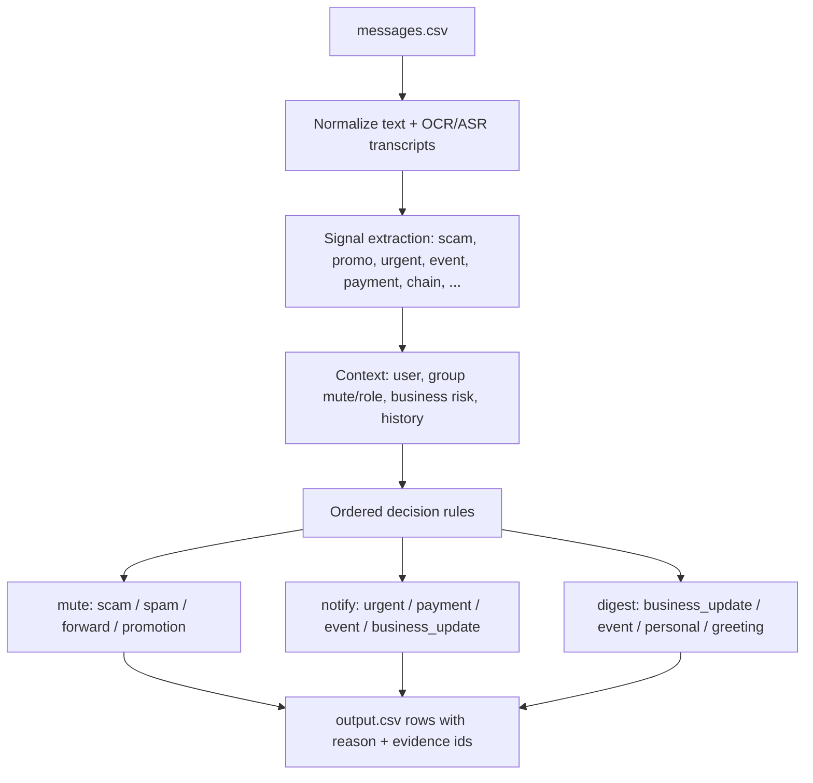

# Message Notification Router

A deterministic, multimodal routing engine that decides — for every incoming
WhatsApp-style message — whether the user should be interrupted **now**
(`notify`), see it **later** (`digest`), or never see it at all (`mute`).

Built for the **HackerRank Orchestrate (August 2026)** challenge. Routes all
110 messages in `dataset/messages.csv` with personalized, explainable
decisions. No LLM in the runtime path; every decision is produced by an
auditable, ordered rule engine over real signals.

```
message_id,action,message_type,reason,confidence,evidence_message_ids
```

## Overview

WhatsApp is noisy: family chats, society notices, school updates, co-worker
incidents, business promotions, image posters, voice notes, and scams all
arrive in one stream. Treating every message the same produces two bad
outcomes — important messages get missed, and unwanted or risky messages
interrupt the user.

This router personalizes the decision per receiving user. The same sale poster
may be `notify` for one user and `mute` for another; a payment reminder may be
legitimate from a trusted group admin but risky from an unknown sender; a muted
family group can still contain an urgent direct mention. Clear scam and safety
risk is muted regardless of the user's usual engagement.

## Features

- **Multimodal understanding** — text signals, OCR of image
  posters/screenshots (`easyocr`), and ASR of voice notes (`faster-whisper`),
  so a field-trip consent image or a spam voice call-back is understood, not
  ignored.
- **Sender trust scoring** — per-business risk from verification status,
  official-vs-used domain mismatch, account/domain age, message volume, and
  user reports.
- **Full personalization** — per-group mute state and roles, business opt-out /
  promo consent / dismissal history, and messages the user dismissed or muted
  after receiving.
- **History-based evidence** — every decision carries `evidence_message_ids`
  retrieved by Jaccard similarity + contextual bonuses (same sender/business/
  group), so reasons are traceable to concrete past messages.
- **Safety-first routing** — prompt-injection, OTP/QR/bank-detail scams, and
  high-report unverified senders are muted before any notify logic runs.
- **Deterministic and reproducible** — identical `output.csv` every run; no
  sampling, no API calls, no hardcoded labels.
- **Evaluation harness** — `code/evaluation/main.py` reports an action
  confusion matrix, per-class precision/recall/F1, and full schema validation.

## Tech Stack

| Concern | Technology |
|---|---|
| Language | Python 3.13 |
| Data | pandas |
| Image OCR (optional preprocess) | easyocr |
| Voice ASR (optional preprocess) | faster-whisper |
| Runtime decisioning | Deterministic rule engine (no LLM) |
| Tests | pytest |

## Architecture

The router is a single-pass pipeline: normalize each message's text plus its
OCR/ASR transcripts, compute ~15 categorical signals from word-boundary-matched
keyword lexicons, then run an ordered set of decision rules.



### Decision-rule ordering

Order matters: the first matching rule wins, so safety runs first.

1. Prompt-injection / routing-override content → `mute scam`
2. Risky business + sensitive ask (OTP/QR/bank details) → `mute scam`
3. Strong scam content (sensitive/link/QR) → `mute scam`
4. Chain forwards & high-count blessing/health forwards → `mute forward`
5. Promotion personalization (opt-out / dismissed / muted / sales-thread
   continuation) → `mute` or `digest promotion`
6. Legitimate payment reminder from a trusted admin with a same-day deadline →
   `notify payment`
7. Urgent / direct-mention / time-bound action → `notify urgent` or `event`
8. Admin school circulars (text or OCR) → `notify event`
9. Business updates gated by why-the-user-knows-the-account → `notify` or
   `digest`
10. Digest fallback for low-priority personal/group content

## Project Structure

```
.
├── README.md                    # This file
├── LICENSE                      # MIT
├── AGENTS.md                    # AI-tooling/logging contract (challenge infra)
├── problem_statement.md         # Original challenge spec
├── requirements.txt             # Runtime dependencies
├── requirements-dev.txt         # Test + optional preprocess dependencies
├── code/
│   ├── main.py                  # Router engine + CLI entry point
│   ├── preprocess_media.py      # Optional OCR/ASR cache generation
│   ├── media_text.json          # Committed OCR/ASR cache (needed for output)
│   ├── evaluation/
│   │   └── main.py              # Evaluation harness (metrics + schema checks)
│   └── README.md                # Code-level run instructions
├── tests/                       # pytest suite
│   ├── test_signals.py
│   ├── test_business_risk.py
│   ├── test_evidence.py
│   └── test_router.py
├── docs/
│   ├── architecture.md          # Detailed pipeline and rule documentation
│   └── results.md               # Verified evaluation results
├── dataset/                     # Input data (CSVs + media), see below
└── .github/
    └── workflows/ci.yml         # CI: install → run → evaluate → test
```

## Getting Started

### Prerequisites

- Python 3.13+
- `pip`

### Installation

```bash
git clone <your-repo-url>
cd hackerrank-orchestrate-august26

python -m venv .venv
.\.venv\Scripts\activate        # Windows
# source .venv/bin/activate     # macOS / Linux

pip install -r requirements.txt
```

### Running the Project

```bash
# Write predictions to dataset/output.csv (110 rows)
python code/main.py

# The output file is git-ignored; it is regenerated deterministically.
```

If `dataset/media/` files exist and you want to regenerate the OCR/ASR cache
from scratch (requires `easyocr` and `faster-whisper`):

```bash
pip install -r requirements-dev.txt
python code/preprocess_media.py --dataset dataset
```

### Testing

```bash
pip install -r requirements-dev.txt
pytest tests/
```

### Evaluating

```bash
python code/evaluation/main.py
```

This runs the router over the 30 labeled messages in
`dataset/sample_messages.csv` and prints an action confusion matrix with
per-class precision/recall/F1, plus schema/coverage validation of
`dataset/output.csv`.

## Usage

```python
# Use the engine programmatically
import os
import sys

import pandas as pd

sys.path.insert(0, os.path.abspath("code"))   # the code/ dir (not a package name)
import main as router

ctx = router.load_context("dataset")
media = router.load_media_text()
msgs = pd.read_csv("dataset/messages.csv")
for _, msg in msgs.iterrows():
    decision = router.route(msg, ctx, media)
    print(decision["message_id"], decision["action"], decision["message_type"], decision["confidence"])
```

## Dataset

All participant-facing input lives in `dataset/` (provided by the challenge):

- `messages.csv` — the 110 incoming messages to route
- `sample_messages.csv` — 30 labeled examples used for evaluation
- `users.csv`, `groups.csv`, `group_members.csv` — user and group context
- `business_accounts.csv`, `user_business_history.csv` — business trust and
  relationship context
- `message_history.csv`, `message_events.csv` — historical messages and user
  reactions (used for evidence and personalization)
- `images.csv`, `voice_notes.csv`, `media/` — raw media for OCR/ASR

See [`problem_statement.md`](./problem_statement.md) for the full schema.

## Results

Verified on the labeled sample set (`dataset/sample_messages.csv`, 30 messages):

| Metric | Value |
|---|---|
| Action accuracy | **30 / 30 (100%)** |
| Precision / Recall / F1 per action | **1.0 / 1.0 / 1.0** for notify, digest, mute |
| Message-type agreement | 23 / 30 |
| Output schema / coverage checks | Pass (110 rows, exact columns, no dupes) |

Full numbers and caveats: [`docs/results.md`](./docs/results.md).

## Roadmap

- **Completed** — multimodal signal extraction, business risk scoring,
  history-based evidence, full 110-message routing, evaluation harness.
- **Planned** — split the monolithic `code/main.py` into focused modules
  (`signals.py`, `context.py`, `rules.py`); add a test for every decision rule;
  cold-start handling for users with no message history.
- **Known limitations** — keyword lexicons need maintenance for new slang and
  evolving scam phrasings; no trainable/adaptive layer; confidence values are
  heuristic, not calibrated.

## Contributing

Open an issue for bugs or proposals, then a pull request. Add tests for any
new rule or keyword change and run `pytest tests/` before submitting. See
[`.github/pull_request_template.md`](.github/pull_request_template.md).

## License

[MIT](./LICENSE) — copyright holder placeholder; update before publishing.


Judge Interview
The main improvement area in your interview is giving code-accurate, step-by-step answers when questions become numeric (especially around trust/risk scoring and thresholds), since several answers slowed into long stalls and then landed on inconsistent arithmetic. A practical rehearsal habit that maps directly to what came up: before the next interview, pick the few “numbers people will probe” (each threshold, cutoff, and coefficient), open the exact function where it lives, and practice saying (1) what inputs it uses, (2) the exact calculation, (3) what each threshold means operationally, and (4) one concrete example message that crosses it. When the exact value isn’t top of mind, it’s better to say you’d verify it in the specific function rather than trying to recompute it live. Finally, the evaluation story landed as small and a bit fragile; preparing one crisp end-to-end measurement narrative (what you checked beyond the small labeled slice, plus any latency/cost notes for OCR/ASR) would make the system feel more owned under follow-ups.

Chat Transcript
What’s captured in your chat transcript shows mostly delegation and logistics prompts (recaps, “continue,” “run it,” and asking where outputs live) rather than you steering an end-to-end plan, pinning down implementation constraints, or driving a verification loop from observed failures. Next time, start the conversation by writing the routing policy and architecture in plain language (what signals exist, what must override what, and where personalization and evidence should be used), then ask the AI to implement that exact contract rather than choosing it. During the build, make each request concrete enough to be testable: specify the required output fields, the key thresholds, and what should happen when media text is missing or uncertain. After the first run, do one candidate-driven review pass: request a short mismatch report and bring back a few specific message IDs that look wrong, then ask for targeted fixes. The submitted record also reads like a compiled/reconstructed document rather than a complete captured back-and-forth, which limited what could be assessed or credited; a full log captured as it happens makes it much easier to show planning, debugging, and safety requirements in action.

Code Zip
As submitted, the system is a deterministic pipeline with a large ruleset deciding outcomes, so it doesn’t demonstrate an agent that reasons, chooses tools, or iterates—there are no model calls, no prompt, and no structured model response to validate. To make this an agent while keeping the good problem-specific work, treat your existing components as tools (context loading, signal extraction, evidence lookup, scam checks), then have a model produce a structured decision plus justification using those tools, with a validator that rejects malformed or unsupported outputs and forces a retry or a safe fallback. Prompting and tool guidance also needs to become first-class: write a concise system instruction that defines the decision policy (including rule ordering) and explicitly requires evidence-grounded reasoning, then enforce the output shape before writing the final row. On the engineering side, a single very large main file made the core logic harder to audit; pushing the decision policy, scoring, and evidence selection into smaller modules with clearer types would make both debugging and interview ownership easier. Finally, the evaluation workflow looks tailored to the small labeled sample; reporting behavior on the broader provided set and being explicit about what was used for iteration versus final reporting would make the results more trustworthy.

Output CSV
The most consistent issue in your output CSV is that message type often drifted toward urgent/event/payment in cases that read more like personal notes, business updates, promotions, or unknowns in the provided dataset, and that mismatch then made the paired reasons feel generic or hard to reconcile with the message. Supporting message references also frequently didn’t line up with the most relevant prior messages, which weakened the “why” even when the final action was otherwise reasonable. The highest-impact next step is to tighten message-type detection (especially separating personal from urgent/events and promotions from scam/spam) and then generate the supporting message references strictly from the same pieces of evidence actually used to justify the decision, so the action, type, and explanation stay mutually consistent.
